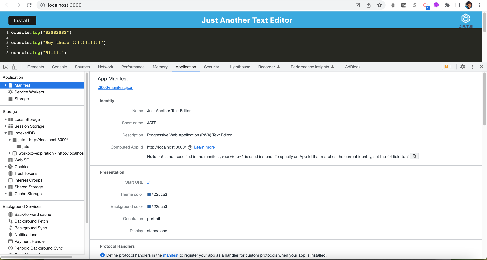

# Text-Editor

## Description 

This is an in browser single-page text editor. It also stores all inputs to your machine (Just in case!). The application will also function offline.

The application can be invoked by using 'npm run start' command. 

## Features

Can be used on and offline
Can be installed as a standalone program
Saves inputs to your machine

## Installation

Open gitbash and navigate to the root directory of the program, then use 'npm run install'. When that is completed use 'npm run start', then you can navigate to http://localhost:3000/ to use the app.

## Screenshot

* Please see the screenshots below

## Link to deployed application